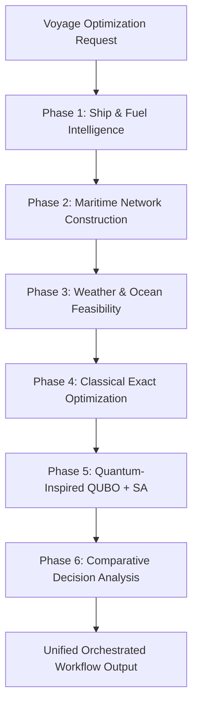

# Phase 7 — Part 1: End-to-End Backend Workflow Orchestration

## Executive Overview

**Phase 7 Part 1** delivers the deterministic end-to-end backend orchestration pipeline for **SIH26138: Quantum-Inspired Fuel Consumption Prediction and Green Fleet Optimization**.

The orchestration layer connects the six discrete analytical and optimization phases into a unified, sequential, and reproducible pipeline without modifying the underlying mathematical models, optimization algorithms, QUBO formulations, or naval architecture equations developed in Phases 1 through 6.



---

## 1. Pipeline Execution Flow & Stage Contracts

Each incoming voyage optimization request flows deterministically through six sequential stages:

| Stage # | Stage Name | Underlying Service | Stage Outputs Retained |
| :--- | :--- | :--- | :--- |
| **Stage 1** | **Ship & Fuel Intelligence** | `FuelIntelligenceService` | Fleet catalog verification, selected vessel context, selected fuel alternative, representative calm-water baseline fuel estimate. |
| **Stage 2** | **Maritime Network Construction** | `DemoRouteProvider` | Verified origin/destination ports, candidate route corridors, segment distance breakdown, draft/beam limits verification (`feasible_routes_count`). |
| **Stage 3** | **Weather & Ocean Feasibility** | `RouteEnvironmentalAssessmentService` | Along-track current calculation, Speed Over Ground ($v_{\text{ground}} = v_{\text{water}} + c_{\text{along}}$), sea state safety checks, route risk levels, demo environmental fuel factors. |
| **Stage 4** | **Classical Exact Optimization** | `ClassicalVoyageOptimizer` | Full combinatorial candidate evaluation ($\text{Vessel} \times \text{Route} \times \text{Speed} \times \text{Fuel}$), global best cost and best time candidates, rejection breakdown, feasibility rate. |
| **Stage 5** | **Quantum-Inspired Optimization** | `QuantumInspiredVoyageOptimizer` | Discrete one-hot QUBO formulation, Simulated Annealing multi-trajectory search, top-K unique solutions, solver runtime, QUBO energy values. |
| **Stage 6** | **Comparative Decision Analysis** | `ComparativeAnalysisService` | Strict 5-objective Pareto dominance front, head-to-head metrics, operator priority recommendations (Cost, Time, Fuel, CO₂, Lifecycle GHG, Balanced). |

---

## 2. API Endpoint Specification

### `POST /api/v1/workflow/optimize`

Executes the orchestrated workflow across all six phases.

#### Request Schema
Accepts either a nested `WorkflowOptimizationRequest` or a flat `VoyageOptimizationRequest` (automatically adapted via Pydantic model validator):

```json
{
  "voyage_request": {
    "source_port_id": "PORT-SG",
    "destination_port_id": "PORT-RTM",
    "cargo_weight_tonnes": 60000.0,
    "departure_datetime": "2026-10-01T12:00:00Z",
    "deadline_datetime": "2026-10-29T12:00:00Z",
    "vessel_ids": null,
    "route_ids": null,
    "speed_grid_step_knots": 0.5,
    "currency": "USD"
  },
  "priority": "balanced",
  "top_k": 5,
  "solver_config": {
    "random_seed": 42,
    "number_of_runs": 5,
    "iterations_per_temperature": 50,
    "cooling_rate": 0.95
  }
}
```

#### Response Schema
Returns `WorkflowOptimizationResponse`:
- `request`: Canonical validated voyage parameters.
- `stages`: Detailed breakdown of each phase's output:
  - `fuel_intelligence`: `FuelIntelligenceStageResult`
  - `maritime_network`: `MaritimeNetworkStageResult`
  - `weather_ocean`: `WeatherOceanStageResult`
  - `classical_optimization`: `ClassicalOptimizationStageResult`
  - `quantum_inspired`: `QuantumInspiredStageResult`
  - `comparative_analysis`: `ComparativeAnalysisStageResult`
- `workflow_metadata`:
  - `workflow_id`: Deterministic hash `WF-{SHA256[:12]}`.
  - `execution_status`: `"completed"` or `"failed"`.
  - `failed_stage`: Identifier of failing stage (or `null` if completed).
  - `error_detail`: Clear diagnostic message if failed.
  - `stage_completion_status`: Status dictionary mapping all 6 stages.
  - `total_runtime_ms`: Wall-clock pipeline execution time in milliseconds.
  - `deterministic_mode`: `true`.
  - `assumptions`: Explicit scientific boundaries.

### `GET /api/v1/workflow/sample-request`
Returns a preconfigured sample workflow payload for demonstration and testing.

---

## 3. Determinism and Reproducibility

- **Canonical Hash**: Every workflow execution generates a deterministic `workflow_id` computed from the canonical tuple: `(source_port_id, destination_port_id, cargo_weight, departure_datetime, deadline_datetime, priority, top_k, seed)`.
- **Seeded Simulated Annealing**: The random seed is explicitly passed to Phase 5's Simulated Annealing solver (default `random_seed=42`).
- **No Non-Deterministic Ties**: All rankings, filters, and optimizations across Phases 4, 5, and 6 use deterministic multi-tier tie-breaking keys based on unique `decision_id` strings.
- **Repeatability**: Repeated executions with identical inputs produce identical decisions, metrics, and Pareto fronts.

---

## 4. Failure Handling & Anti-Fabrication Safeguards

The orchestrator enforces strict early-stopping semantics:
1. **Invalid Ports/Vessels**: If an unknown port or invalid vessel ID is provided, the pipeline halts immediately at Phase 2 (or Phase 1) with an HTTP 404 error detailing the missing identifier.
2. **Physical / Schedule Infeasibility**: If physical constraints or an impossible arrival deadline preclude any feasible solutions, the pipeline halts before downstream metaheuristic solving. **Under no circumstances does the system fabricate synthetic downstream results.**
3. **Structured Failure Metadata**: The failing stage is explicitly identified in `failed_stage`, and unexecuted downstream stages remain unexecuted (`pending`).

---

## 5. Architectural Non-Goals & Integrity Guarantees

- **No Duplicated Optimization Logic**: Calls existing services directly as single source of truth.
- **No Alteration of Locked Mathematical Models**: Does not touch fuel equations, draft verifications, weather penalties, QUBO matrix formulations, or Pareto dominance logic.
- **Scientific Transparency**: No claims of quantum supremacy or physical quantum hardware; explicitly states that Phase 5 uses classical Simulated Annealing on a discrete QUBO formulation.

---

## 6. Phase 7 Part 2: Frontend Integration

The presentation-ready maritime frontend integrates the complete workflow into a unified user experience:
1. **Interactive Workflow Component**: [`EndToEndWorkflowOptimizer.tsx`](file:///c:/Users/Ritheesh/Desktop/WORK/Projects/SIH%20Demo/frontend/src/components/EndToEndWorkflowOptimizer.tsx) provides a single control panel to configure origin, destination, cargo, departure, deadline, priority, and Simulated Annealing seed.
2. **Unified Invocation**: The primary action **"Run End-to-End Optimization"** sends a single request directly to `POST /api/v1/workflow/optimize`. Individual phase endpoints are not queried separately.
3. **Six-Stage Live Progress Indicator**: Tracks real-time stage progression across Ship & Fuel Intelligence, Maritime Network, Weather & Ocean, Classical Optimization, Quantum-Inspired QUBO, and Comparative Decision Analysis.
4. **Intermediate Stage Inspection**: Displays key metrics for each completed phase, including verified corridors, weather fuel multipliers, combinatorial combinations evaluated, QUBO variables, and SA runtime.
5. **Clear Semantic Distinction**: Explicitly identifies the **"Phase 1 Representative Fuel Estimate"** as a calm-water baseline calculation over 1,000 NM, clearly distinguishing it from the downstream multi-stage **"Optimized Voyage Fuel Consumption"**.
6. **Integrated Final Decision Dashboard**: Reuses [`ComparativeDecisionAnalysis.tsx`](file:///c:/Users/Ritheesh/Desktop/WORK/Projects/SIH%20Demo/frontend/src/components/ComparativeDecisionAnalysis.tsx) to present the non-dominated Pareto trade-off curve, priority recommendations, balanced distance to ideal point, schedule buffer, and scientific assumptions.
7. **Error Handling & Anti-Fabrication**: In the event of an invalid port (404) or infeasible voyage schedule (400), the UI highlights the failing stage, displays server diagnostic details, and never fabricates downstream results.
8. **Automated Verification**: 10 automated frontend tests (`endToEndWorkflow.test.mjs`) verify rendering, endpoint targeting, payload structure, loading progression, labeling, and error handling.
